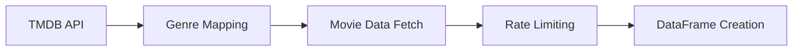
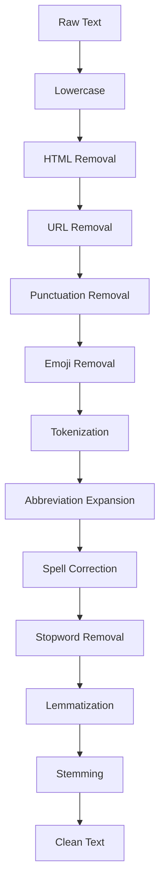

# 🎬 TMDB Movie Data Pipeline

A comprehensive Python application for fetching, processing, and analyzing top-rated movies from The Movie Database (TMDB) API with advanced text preprocessing capabilities.

## 📋 Table of Contents

- [Overview](#overview)
- [Features](#features)
- [Project Structure](#project-structure)
- [Installation](#installation)
- [Configuration](#configuration)
- [Usage](#usage)
- [API Reference](#api-reference)
- [Data Processing Pipeline](#data-processing-pipeline)
- [Output Format](#output-format)
- [Dependencies](#dependencies)
- [Contributing](#contributing)
- [License](#license)
- [Troubleshooting](#troubleshooting)

## 🎯 Overview

This project provides a robust data pipeline for collecting and preprocessing movie data from TMDB's extensive database. It fetches top-rated movies with their descriptions and genres, then applies comprehensive text preprocessing techniques including tokenization, lemmatization, stemming, and stopword removal to prepare the data for further analysis or machine learning applications.

### Key Capabilities

- **Data Acquisition**: Automated fetching of top-rated movies from TMDB API
- **Genre Mapping**: Intelligent conversion of genre IDs to human-readable names
- **Text Preprocessing**: Advanced NLP preprocessing pipeline
- **Rate Limiting**: Respectful API usage with built-in delays
- **Error Handling**: Robust error handling for API failures
- **CSV Export**: Clean data export for further analysis

## ✨ Features

### 🔄 Data Acquisition
- Fetch top-rated movies from TMDB API with pagination support
- Automatic genre ID to name mapping
- Configurable number of pages to process
- Built-in rate limiting to respect API guidelines
- Comprehensive error handling and status code validation

### 🧹 Text Preprocessing
- **HTML Tag Removal**: Clean HTML content from descriptions
- **URL Removal**: Strip web URLs and links
- **Punctuation Removal**: Remove all punctuation marks
- **Emoji Handling**: Remove or replace emojis
- **Tokenization**: Split text into individual words
- **Chat/Abbreviation Expansion**: Convert common abbreviations (u → you, r → are)
- **Spell Correction**: Automatic spelling correction
- **Stopword Removal**: Remove common English stopwords
- **Lemmatization**: Convert words to their base forms
- **Stemming**: Reduce words to their root forms

### 📊 Data Export
- CSV format with clean, structured data
- Preprocessed text ready for analysis
- Genre information preserved and readable

## 📁 Project Structure

```
tmdb/
├── README.md                           # Project documentation
├── main.py                            # Main application entry point
├── data_acquisition.py                # TMDB API interaction module
├── text_preprocessing.py              # NLP preprocessing pipeline
├── hello.py                          # Simple greeting module
├── requirements.txt                   # Python dependencies
├── pyproject.toml                    # Project configuration
├── uv.lock                           # Dependency lock file
├── .env                              # Environment variables (not in git)
├── .env.example                      # Environment variables template
├── .gitignore                        # Git ignore rules
├── top_rated_movies_with_genres.csv  # Sample output data
└── __pycache__/                      # Python cache directory
```

## 🚀 Installation

### Prerequisites

- Python 3.10 or higher
- TMDB API key (free registration required)
- Internet connection for API calls and NLTK data downloads

### Step 1: Clone the Repository

```bash
git clone <repository-url>
cd tmdb
```

### Step 2: Create Virtual Environment (Recommended)

```bash
# Using venv
python -m venv venv
source venv/bin/activate  # On Windows: venv\Scripts\activate

# Or using conda
conda create -n tmdb python=3.10
conda activate tmdb
```

### Step 3: Install Dependencies

```bash
pip install -r requirements.txt
```

### Step 4: Environment Configuration

1. Copy the example environment file:
```bash
cp .env.example .env
```

2. Edit `.env` and add your TMDB API key:
```bash
# Open .env in your preferred editor
nano .env  # or code .env, vim .env, etc.
```

3. Replace `your_api_key_here` with your actual TMDB API key

### Step 5: NLTK Data Download

The application will automatically download required NLTK data on first run:
- punkt (tokenization)
- stopwords (English stopwords)
- wordnet (lemmatization)
- omw-1.4 (multilingual wordnet)

## ⚙️ Configuration

### TMDB API Key Setup

1. Register for a free account at [TMDB](https://www.themoviedb.org/)
2. Navigate to API settings and generate an API key
3. Copy the example environment file:
   ```bash
   cp .env.example .env
   ```
4. Edit `.env` and replace `your_api_key_here` with your actual API key:
   ```bash
   TMDB_API_KEY=your_actual_api_key_here
   ```

> ✅ **Security Best Practice**: API keys are stored in `.env` file which is excluded from version control via `.gitignore`.

### Customizable Parameters

#### In `main.py`:
- `pages`: Number of pages to fetch (default: 10, max: ~500)

#### In `data_acquisition.py`:
- `time.sleep(0.5)`: API rate limiting delay (adjustable)
- `language`: API language parameter (default: "en-US")

#### In `text_preprocessing.py`:
- `chat_dict`: Expandable abbreviation dictionary
- Language settings for spell checker and stopwords

## 🎮 Usage

### Basic Usage

Run the main application to fetch and process movie data:

```bash
python main.py
```

This will:
1. Fetch top-rated movies from TMDB (10 pages by default)
2. Apply text preprocessing to movie descriptions
3. Save results to `top_rated_movies_with_genres.csv`
4. Display the first 10 processed movies

### Advanced Usage

#### Fetch More Data

Modify the `pages` parameter in `main.py`:

```python
df = fetch_top_rated_movies(pages=50)  # Fetch 50 pages (~1000 movies)
```

#### Custom Text Preprocessing

Use the preprocessing function independently:

```python
from text_preprocessing import preprocess_text

# Example usage
raw_text = "This is a GREAT movie!!! 😍 Check it out at https://example.com"
clean_text = preprocess_text(raw_text)
print(clean_text)  # Output: "great movi check"
```

#### Direct API Access

Use the data acquisition module separately:

```python
from data_acquisition import fetch_top_rated_movies

# Fetch data without preprocessing
df = fetch_top_rated_movies(pages=5)
print(df.head())
```

## 📚 API Reference

### `data_acquisition.py`

#### `fetch_top_rated_movies(pages=100)`

Fetches top-rated movies from TMDB API.

**Parameters:**
- `pages` (int): Number of pages to fetch (default: 100)

**Returns:**
- `pandas.DataFrame`: DataFrame with columns:
  - `movie_name`: Movie title
  - `description`: Movie overview/description
  - `genre`: Comma-separated genre names

**Example:**
```python
df = fetch_top_rated_movies(pages=5)
print(f"Fetched {len(df)} movies")
```

### `text_preprocessing.py`

#### `preprocess_text(text: str) -> str`

Applies comprehensive text preprocessing pipeline.

**Parameters:**
- `text` (str): Raw text to preprocess

**Returns:**
- `str`: Cleaned and preprocessed text

**Processing Steps:**
1. Lowercase conversion
2. HTML tag removal
3. URL removal
4. Punctuation removal
5. Emoji removal
6. Tokenization
7. Abbreviation expansion
8. Spell correction
9. Stopword removal
10. Lemmatization
11. Stemming

**Example:**
```python
raw = "This movie is AMAZING!!! 😍 You should watch it!"
clean = preprocess_text(raw)
print(clean)  # Output: "movi amaz watch"
```

## 🔄 Data Processing Pipeline

### 1. Data Acquisition Phase



### 2. Text Preprocessing Phase



## 📄 Output Format

The application generates a CSV file with the following structure:

| Column | Description | Example |
|--------|-------------|---------|
| `movie_name` | Original movie title | "The Shawshank Redemption" |
| `description` | Preprocessed movie description | "imprison 1940 doubl murder wife..." |
| `genre` | Comma-separated genre names | "Drama, Crime" |

### Sample Output

```csv
movie_name,description,genre
The Shawshank Redemption,imprison 1940 doubl murder wife lover stand banker...,Drama, Crime
The Godfather,span year 1945 1955 chronicl fiction italianamerican...,Drama, Crime
Spirited Away,young girl chihiro becom trap strang new world spirit...,Animation, Family, Fantasy
```

## 📦 Dependencies

### Core Dependencies

| Package | Version | Purpose |
|---------|---------|---------|
| `requests` | 2.32.5 | HTTP requests for API calls |
| `pandas` | 2.3.2 | Data manipulation and analysis |
| `nltk` | 3.9.1 | Natural language processing |
| `beautifulsoup4` | 4.13.5 | HTML parsing and removal |
| `emoji` | 2.14.1 | Emoji handling and removal |
| `autocorrect` | - | Automatic spell correction |
| `python-dotenv` | 1.0.0 | Environment variable management |

### Supporting Dependencies

- `numpy` (2.2.6): Numerical computing support
- `regex` (2025.7.34): Advanced regular expressions
- `tqdm` (4.67.1): Progress bars for long operations
- `click` (8.2.1): Command-line interface utilities

### Development Dependencies

- `setuptools` (65.5.0): Package building tools
- `pip` (25.2): Package installer

## 🤝 Contributing

We welcome contributions! Please follow these guidelines:

### Getting Started

1. Fork the repository
2. Create a feature branch: `git checkout -b feature-name`
3. Make your changes
4. Add tests if applicable
5. Commit your changes: `git commit -m "Add feature"`
6. Push to the branch: `git push origin feature-name`
7. Submit a pull request

### Code Style

- Follow PEP 8 Python style guidelines
- Use meaningful variable and function names
- Add docstrings to all functions
- Include type hints where appropriate

### Testing

Before submitting a pull request:

1. Test with different page counts
2. Verify API key functionality
3. Test text preprocessing with various inputs
4. Ensure CSV output is properly formatted

## 📄 License

This project is licensed under the MIT License. See the [LICENSE](LICENSE) file for details.

## 🔧 Troubleshooting

### Common Issues

#### API Key Errors

**Problem**: `401 Unauthorized` or API key errors

**Solution**:
- Verify your TMDB API key is correct
- Ensure the API key is active and not expired
- Check for any typos in the API key

#### NLTK Data Download Issues

**Problem**: NLTK data not found errors

**Solution**:
```python
import nltk
nltk.download('all')  # Download all NLTK data
```

#### Memory Issues with Large Datasets

**Problem**: Out of memory errors when processing many pages

**Solution**:
- Reduce the number of pages processed
- Process data in smaller batches
- Increase system memory or use a more powerful machine

#### Rate Limiting Issues

**Problem**: API rate limit exceeded

**Solution**:
- Increase the `time.sleep()` value in `data_acquisition.py`
- Reduce the number of concurrent requests
- Consider implementing exponential backoff

### Performance Optimization

#### For Large Datasets

1. **Batch Processing**: Process movies in smaller batches
2. **Parallel Processing**: Use multiprocessing for text preprocessing
3. **Memory Management**: Clear intermediate variables
4. **Caching**: Cache genre mappings to avoid repeated API calls

#### For Faster Processing

1. **Reduce Preprocessing Steps**: Comment out unnecessary preprocessing steps
2. **Optimize Regex**: Use compiled regex patterns for better performance
3. **Vectorized Operations**: Use pandas vectorized operations where possible

### Getting Help

If you encounter issues not covered here:

1. Check the [Issues](../../issues) page for similar problems
2. Create a new issue with:
   - Python version
   - Operating system
   - Full error message
   - Steps to reproduce
3. Contact the maintainers

---

## 🙏 Acknowledgments

- [The Movie Database (TMDB)](https://www.themoviedb.org/) for providing the comprehensive movie API
- [NLTK](https://www.nltk.org/) team for natural language processing tools
- [Pandas](https://pandas.pydata.org/) developers for data manipulation capabilities
- Open source community for various supporting libraries

---

**Made with ❤️ for movie data enthusiasts and NLP practitioners**